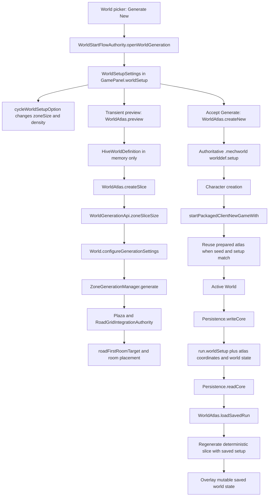

# World Generation Workflow Map

This map traces fixed world-size selection from the new-world UI through generation, persistence, and loading.

## End-to-end flow

## Ownership by stage

| Stage | Authority | Size-bearing value | Required behavior |
|---|---|---|---|
| UI selection | `GamePanel.worldSetup` | `zoneSize` | Changes remain local until Generate is accepted. |
| Preview | `WorldAtlas.preview` | copied `WorldSetupSettings` | Generates in memory and never writes `.mechworld`. |
| New-world acceptance | `WorldAtlas.createNew` | copied selected setup | Creates a fresh definition for the seed and stores `worlddef.setup`. |
| Existing-world selection | `.mechworld` | `worlddef.setup` | Stored world definition remains authoritative. |
| Slice sizing | `WorldGenerationApi.zoneSliceSize` | resolved setup/profile | Derives width and height from the selected worldgen weight band. |
| Slice generation | `World.generationSettings` | full encoded setup | Roads, room targets, NPC density, and later passes use the same setup. |
| Save slot | `Persistence.writeCore` | `run.worldSetup` | Records the setup needed for deterministic reconstruction. |
| Save load | `Persistence.readCore` | saved `run.worldSetup` | Rebuilds the atlas and slice with saved settings before restoring mutable state. |

## Generation implementation chain

1. `WorldSetupSettings.scaleProfile(...)` converts fixed size and density selections into dimension and room-pressure bounds.
2. `WorldGenerationApi.zoneSliceSize(seed, settings)` selects deterministic dimensions inside those bounds.
3. `WorldAtlas.createSlice(...)` creates `World`, applies the same settings, assigns coordinates and zone type, then calls `World.generate()`.
4. `ZoneGenerationManager.generate(...)` runs the generation phases.
5. `World.worldgenPhasePlazaAndRoads(...)` places the plaza and invokes `RoadGridIntegrationAuthority.apply(...)`.
6. `World.roadFirstRoomTarget()` combines scale profile, map area, road spines, frontage anchors, and size-specific minimums.
7. Later room, faction, economy, object, NPC, lighting, hazard, transition, validation, and repair passes operate on that generated slice.

## Disconnects found in the June 13 pretest

### 1. Preview persistence captured the wrong setup

`WorldStartFlowAuthority` generated previews through the normal persistent `WorldAtlas` constructor. Opening the screen started a Standard preview and immediately wrote an explicit Standard `.mechworld`. Changing size reused the same seed, reloaded that file, and treated its old setup as authoritative. Final generation therefore remained Standard.

Runtime evidence showed `CAMPAIGN_WORLD_LOAD/SAVE ... size Standard`, Standard profiles, and maps around `181x129` and `216x131` during the failed test.

### 2. Save loading discarded `run.worldSetup`

`Persistence.writeCore` stored `run.worldSetup`, but `Persistence.readCore` rebuilt the atlas with `new WorldAtlas(atlasSeed)`, which defaults to Standard. Since physical tiles are regenerated rather than fully serialized, this could reconstruct a different-sized map before mutable state was restored.

### 3. Saved coordinates were applied after scaffold generation

The loader generated the default insertion slice before restoring atlas coordinates. The corrected flow restores coordinates first, then generates the requested current slice.

## Corrected invariants

- Preview generation is side-effect free with respect to world files.
- Preview generation does not mutate the process-wide active economy/crafting settings.
- Explicit Generate New uses the currently selected setup even if a stale definition exists for that seed.
- Existing World uses its stored definition.
- Save Load uses the save-time setup for deterministic reconstruction.
- Every generated `World` retains the same setup used to derive its dimensions and room/road budgets.

## Stable modifier hooks

Milestone code should resolve setup effects through `WorldGenerationSettingsAuthority` instead of reading raw option indexes or the mutable global settings object.

Primary entry points:

- `WorldGenerationSettingsAuthority.resolve(settings)` for draft UI, preview, tooling, and tests.
- `WorldGenerationSettingsAuthority.forWorld(world)` for generation and world-owned simulation.
- `WorldGenerationSettingsAuthority.forGame(game)` for active gameplay systems.
- `WorldGenerationSettingsAuthority.active()` only for legacy consumers that cannot yet receive a world or game context.
- `WorldGenerationSettingsAuthority.forWorld(world)` for modifiers resolved from the setup captured by a generated slice.
- `WorldGenerationSettingsAuthority.consumerPointers()` for discoverable option-to-consumer ownership.
- Named calculation hooks: `adjustedBuyPrice`, `adjustedSellPrice`, `adjustedCraftCost`, and `playerCarryCapacity`.

Stable option identifiers:

| Identifier | Resolved modifier | Current consumers |
|---|---|---|
| `worldgen.npc_density` | NPC population multiplier | `World.populate`, NPC population seeding |
| `worldgen.zone_size` | weight band, dimensions, road and room minima | `zoneSliceSize`, `roadFirstRoomTarget`, road spine distribution |
| `worldgen.zone_density` | room-pressure multiplier | scale profile and target room count |
| `worldgen.price_difficulty` | buy/sell price multiplier | `TraderSession` pricing |
| `worldgen.craft_difficulty` | supplies and machine-parts multiplier | `CraftingRecipe` costs |
| `worldgen.hoarder_mode` | unlimited player carry capacity | `GamePanel.carryCapacity` |
| `worldgen.simulation_age` | historical simulation batch count | `WorldAtlas` history initialization |

`WorldTopologySettingsBridge` and its 500-1000 fixed-square `SectorSize` contract remain a separate topology migration surface. They are not silently treated as the four-option `zoneSize` selector; milestone work must choose and document an explicit migration before joining those models.
